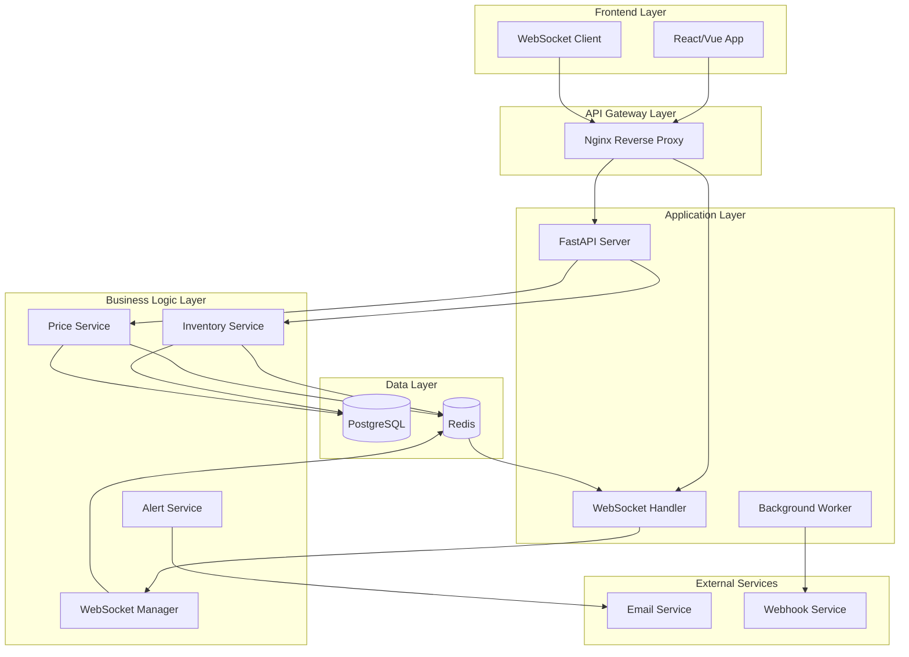
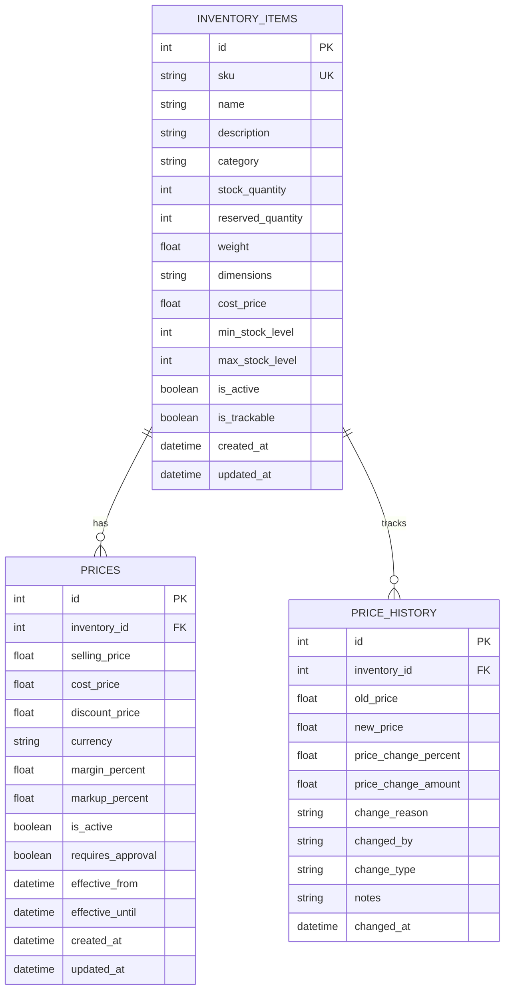

# 🏗️ FastAPI リアルタイム在庫・価格監視API アーキテクチャ解説

## 📖 目次

1. [システム全体像](#システム全体像)
2. [レイヤーアーキテクチャ](#レイヤーアーキテクチャ)
3. [データベース設計](#データベース設計)
4. [リアルタイム通信](#リアルタイム通信)
5. [セキュリティ](#セキュリティ)
6. [スケーラビリティ](#スケーラビリティ)
7. [監視・ログ](#監視ログ)

---

## 🌐 システム全体像

### 🔧 アーキテクチャ概要



### ⚡ 技術スタック詳細

#### バックエンド (Python)
```yaml
Core Framework:
  - FastAPI 0.104.1      # 非同期Webフレームワーク
  - Uvicorn 0.24.0       # ASGI サーバー
  - Pydantic 2.5.0       # データバリデーション

Database:
  - SQLAlchemy 2.0.23    # 非同期ORM
  - Asyncpg 0.29.0       # PostgreSQL 非同期ドライバー
  - Alembic 1.13.0       # マイグレーションツール

Caching & Messaging:
  - Redis 5.0.1          # インメモリデータストア
  - AioRedis 2.0.1       # Redis 非同期クライアント

Authentication & Security:
  - Python-Jose 3.3.0    # JWT ハンドリング
  - Passlib 1.7.4        # パスワードハッシュ化

Monitoring:
  - Structlog 23.2.0     # 構造化ログ
```

#### インフラ
```yaml
Database:
  - PostgreSQL 15        # メインデータストレージ
  - Redis 7               # キャッシュ・メッセージング

Containerization:
  - Docker                # コンテナ化
  - Docker Compose        # ローカル開発環境

Web Server:
  - Nginx                 # リバースプロキシ (本番用)
```

### 🔄 データフロー図

#### API リクエストフロー
```
1. Client Request
   ↓
2. FastAPI Router
   ↓  
3. Pydantic Validation
   ↓
4. Service Layer (Business Logic)
   ↓
5. Database/Cache Query
   ↓
6. Response Serialization
   ↓
7. Client Response
```

#### リアルタイム更新フロー
```
1. Data Change (API)
   ↓
2. Service Layer Update
   ↓
3. Redis Pub/Sub Publish
   ↓
4. WebSocket Manager
   ↓
5. All Connected Clients
```

---

## 🏛️ レイヤーアーキテクチャ

### 📁 ディレクトリ構造と責務

```
app/
├── 🌐 api/              # API Interface Layer
│   └── v1/
│       ├── api.py       # ルーター集約
│       └── endpoints/   # エンドポイント定義
│
├── ⚙️ core/             # Core Configuration Layer
│   ├── config.py        # アプリケーション設定
│   ├── database.py      # DB接続・セッション管理
│   └── redis_client.py  # Redis 接続管理
│
├── 🗄️ models/          # Data Model Layer
│   ├── inventory.py     # 在庫テーブル定義
│   └── price.py         # 価格テーブル定義
│
├── 📋 schemas/          # Data Validation Layer
│   ├── inventory.py     # 在庫データスキーマ
│   └── price.py         # 価格データスキーマ
│
├── 🔧 services/        # Business Logic Layer
│   ├── inventory_service.py  # 在庫操作ロジック
│   ├── price_service.py      # 価格操作ロジック
│   └── websocket_manager.py  # リアルタイム通信
│
└── 📄 main.py          # Application Entry Point
```

### 🎯 各層の詳細解説

#### 1. API Interface Layer (`api/`)
**責務**: HTTPリクエスト・レスポンス処理、ルーティング

```python
# api/v1/endpoints/inventory.py
from fastapi import APIRouter, Depends, HTTPException, status
from app.services.inventory_service import InventoryService
from app.schemas.inventory import InventoryCreate, InventoryResponse

router = APIRouter()

@router.post("/", response_model=InventoryResponse, status_code=status.HTTP_201_CREATED)
async def create_inventory_item(
    item: InventoryCreate,
    service: InventoryService = Depends()
):
    """新規在庫アイテム作成"""
    try:
        return await service.create_inventory_item(item)
    except ValueError as e:
        raise HTTPException(status_code=400, detail=str(e))
    except Exception as e:
        raise HTTPException(status_code=500, detail="Internal server error")
```

#### 2. Business Logic Layer (`services/`)
**責務**: ビジネスルール、データ操作、外部連携

```python
# services/inventory_service.py
from sqlalchemy.ext.asyncio import AsyncSession
from app.models.inventory import Inventory
from app.core.redis_client import get_redis_client

class InventoryService:
    def __init__(self, db: AsyncSession):
        self.db = db
        
    async def create_inventory_item(self, item_data: InventoryCreate) -> Inventory:
        """在庫アイテム作成ビジネスロジック"""
        
        # 1. ビジネスルール検証
        await self._validate_sku_unique(item_data.sku)
        await self._validate_stock_levels(item_data)
        
        # 2. データベース保存
        db_item = Inventory(**item_data.model_dump())
        self.db.add(db_item)
        await self.db.commit()
        await self.db.refresh(db_item)
        
        # 3. キャッシュ更新
        await self._update_cache(db_item)
        
        # 4. リアルタイム通知
        await self._notify_websocket_clients(db_item, "created")
        
        # 5. アラート処理
        if db_item.is_low_stock:
            await self._send_low_stock_alert(db_item)
            
        return db_item
```

#### 3. Data Model Layer (`models/`)
**責務**: データベーススキーマ定義、リレーション設定

```python
# models/inventory.py
from sqlalchemy import Column, Integer, String, Float, Boolean, DateTime
from sqlalchemy.sql import func
from app.core.database import Base

class Inventory(Base):
    __tablename__ = "inventory_items"
    
    id = Column(Integer, primary_key=True, index=True)
    sku = Column(String(100), unique=True, index=True, nullable=False)
    name = Column(String(255), nullable=False)
    stock_quantity = Column(Integer, default=0)
    reserved_quantity = Column(Integer, default=0)
    min_stock_level = Column(Integer, default=10)
    cost_price = Column(Float, default=0.0)
    
    created_at = Column(DateTime(timezone=True), server_default=func.now())
    updated_at = Column(DateTime(timezone=True), onupdate=func.now())
    
    @property
    def available_quantity(self) -> int:
        """利用可能在庫数"""
        return max(0, self.stock_quantity - self.reserved_quantity)
    
    @property
    def is_low_stock(self) -> bool:
        """在庫不足判定"""
        return self.available_quantity <= self.min_stock_level
```

#### 4. Data Validation Layer (`schemas/`)
**責務**: 入力データ検証、型安全性、APIドキュメント生成

```python
# schemas/inventory.py
from pydantic import BaseModel, Field, ConfigDict
from typing import Optional
from datetime import datetime

class InventoryBase(BaseModel):
    """基本在庫スキーマ"""
    sku: str = Field(..., min_length=1, max_length=100, description="商品コード")
    name: str = Field(..., min_length=1, max_length=255, description="商品名")
    stock_quantity: int = Field(0, ge=0, description="在庫数量")
    min_stock_level: int = Field(10, ge=0, description="最小在庫レベル")
    cost_price: float = Field(0.0, ge=0, description="原価")

class InventoryCreate(InventoryBase):
    """在庫作成用スキーマ"""
    model_config = ConfigDict(
        json_schema_extra={
            "example": {
                "sku": "LAPTOP-001",
                "name": "ゲーミングノートPC",
                "stock_quantity": 25,
                "min_stock_level": 5,
                "cost_price": 180000.0
            }
        }
    )

class InventoryResponse(InventoryBase):
    """API レスポンス用スキーマ"""
    model_config = ConfigDict(from_attributes=True)
    
    id: int
    available_quantity: int
    is_low_stock: bool
    created_at: datetime
    updated_at: datetime
```

### 🔄 依存性注入 (Dependency Injection)

#### FastAPI Depends システム

```python
# core/dependencies.py
from sqlalchemy.ext.asyncio import AsyncSession
from app.core.database import get_async_session
from app.services.inventory_service import InventoryService

async def get_inventory_service(
    db: AsyncSession = Depends(get_async_session)
) -> InventoryService:
    """在庫サービスの依存性注入"""
    return InventoryService(db)

# 使用例
@router.post("/")
async def create_item(
    item: InventoryCreate,
    service: InventoryService = Depends(get_inventory_service)
):
    return await service.create_inventory_item(item)
```

#### 利点
- **疎結合**: レイヤー間の依存性最小化
- **テストしやすさ**: モックオブジェクトの注入が簡単
- **再利用性**: サービスクラスの複数エンドポイントでの共有

---

## 🗄️ データベース設計

### 📊 ER図



### 🔑 データベーススキーマ詳細

#### 在庫テーブル (`inventory_items`)
```sql
CREATE TABLE inventory_items (
    id SERIAL PRIMARY KEY,
    sku VARCHAR(100) UNIQUE NOT NULL,        -- 商品コード
    name VARCHAR(255) NOT NULL,              -- 商品名
    description TEXT,                        -- 商品説明
    category VARCHAR(100),                   -- カテゴリ
    
    stock_quantity INTEGER DEFAULT 0,       -- 在庫数量
    reserved_quantity INTEGER DEFAULT 0,    -- 予約済み数量
    
    weight FLOAT,                           -- 重量(g)
    dimensions VARCHAR(100),                -- サイズ
    
    cost_price FLOAT DEFAULT 0.0,          -- 原価
    min_stock_level INTEGER DEFAULT 10,    -- 最小在庫レベル
    max_stock_level INTEGER DEFAULT 1000,  -- 最大在庫レベル
    
    is_active BOOLEAN DEFAULT true,        -- 有効フラグ
    is_trackable BOOLEAN DEFAULT true,     -- 追跡可能フラグ
    
    created_at TIMESTAMP WITH TIME ZONE DEFAULT NOW(),
    updated_at TIMESTAMP WITH TIME ZONE DEFAULT NOW()
);

-- インデックス
CREATE INDEX idx_inventory_sku ON inventory_items(sku);
CREATE INDEX idx_inventory_category ON inventory_items(category);
CREATE INDEX idx_inventory_stock_level ON inventory_items(stock_quantity);
```

#### 価格テーブル (`prices`)
```sql
CREATE TABLE prices (
    id SERIAL PRIMARY KEY,
    inventory_id INTEGER REFERENCES inventory_items(id) ON DELETE CASCADE,
    
    selling_price FLOAT NOT NULL,          -- 販売価格
    cost_price FLOAT NOT NULL,             -- 原価
    discount_price FLOAT,                  -- 割引価格
    currency VARCHAR(3) DEFAULT 'JPY',     -- 通貨
    
    margin_percent FLOAT,                  -- マージン率
    markup_percent FLOAT,                  -- マークアップ率
    
    is_active BOOLEAN DEFAULT true,        -- 有効フラグ
    requires_approval BOOLEAN DEFAULT false, -- 承認要求フラグ
    
    effective_from TIMESTAMP WITH TIME ZONE DEFAULT NOW(), -- 有効開始日
    effective_until TIMESTAMP WITH TIME ZONE,             -- 有効終了日
    
    created_at TIMESTAMP WITH TIME ZONE DEFAULT NOW(),
    updated_at TIMESTAMP WITH TIME ZONE DEFAULT NOW()
);

-- インデックス
CREATE INDEX idx_prices_inventory_id ON prices(inventory_id);
CREATE INDEX idx_prices_effective_period ON prices(effective_from, effective_until);
```

### 🔍 パフォーマンス最適化

#### インデックス戦略
```sql
-- 複合インデックス（よく一緒に検索される列）
CREATE INDEX idx_inventory_category_active ON inventory_items(category, is_active);
CREATE INDEX idx_prices_active_effective ON prices(is_active, effective_from, effective_until);

-- 部分インデックス（条件付きインデックス）
CREATE INDEX idx_low_stock_items ON inventory_items(stock_quantity) 
    WHERE stock_quantity <= min_stock_level;

-- 関数ベースインデックス
CREATE INDEX idx_available_quantity ON inventory_items((stock_quantity - reserved_quantity));
```

#### クエリ最適化例
```python
# 悪い例: N+1クエリ問題
async def get_items_with_prices_bad():
    items = await db.execute(select(Inventory))
    for item in items:
        prices = await db.execute(select(Price).where(Price.inventory_id == item.id))
        
# 良い例: JOINを使用
async def get_items_with_prices_good():
    result = await db.execute(
        select(Inventory, Price)
        .join(Price, Inventory.id == Price.inventory_id)
        .options(selectinload(Inventory.prices))  # 関連データの事前読み込み
    )
    return result.all()
```

---

## 🔌 リアルタイム通信

### 🌐 WebSocket アーキテクチャ

#### WebSocket Manager 設計
```python
# services/websocket_manager.py
import asyncio
import json
from typing import Dict, List, Set
from fastapi import WebSocket
from app.core.redis_client import get_redis_client

class WebSocketManager:
    def __init__(self):
        # 接続タイプ別にWebSocket接続を管理
        self.connections: Dict[str, Set[WebSocket]] = {
            "inventory": set(),
            "price": set(),
            "general": set()
        }
        self.redis_subscribers: Dict[str, object] = {}
        
    async def connect(self, websocket: WebSocket, connection_type: str = "general"):
        """WebSocket接続の受け入れ"""
        await websocket.accept()
        self.connections[connection_type].add(websocket)
        
        # Redis購読の開始（初回接続時）
        if not self.redis_subscribers.get(connection_type):
            await self._start_redis_subscription(connection_type)
            
        logger.info(
            "WebSocket client connected",
            connection_type=connection_type,
            total_connections=len(self.connections[connection_type])
        )

    async def disconnect(self, websocket: WebSocket, connection_type: str = "general"):
        """WebSocket接続の終了"""
        self.connections[connection_type].discard(websocket)
        
        logger.info(
            "WebSocket client disconnected",
            connection_type=connection_type,
            remaining_connections=len(self.connections[connection_type])
        )

    async def broadcast_to_type(self, connection_type: str, message: dict):
        """特定タイプの接続にブロードキャスト"""
        if not self.connections[connection_type]:
            return
            
        message_str = json.dumps(message, default=str)
        disconnected = set()
        
        # 全接続にメッセージ送信
        for websocket in self.connections[connection_type].copy():
            try:
                await websocket.send_text(message_str)
            except Exception:
                # 切断されたWebSocketを記録
                disconnected.add(websocket)
                
        # 切断された接続をクリーンアップ
        for websocket in disconnected:
            self.connections[connection_type].discard(websocket)
            
        logger.info(
            "Broadcasted message to WebSocket clients",
            connection_type=connection_type,
            successful_sends=len(self.connections[connection_type]),
            failed_sends=len(disconnected)
        )

    async def _start_redis_subscription(self, connection_type: str):
        """Redis Pub/Sub購読開始"""
        redis = await get_redis_client()
        pubsub = redis.pubsub()
        
        # チャンネルマッピング
        channels = {
            "inventory": ["inventory:updates", "stock:alerts"],
            "price": ["price:updates", "price:alerts"],
            "general": ["system:notifications"]
        }
        
        for channel in channels.get(connection_type, []):
            await pubsub.subscribe(channel)
            
        # バックグラウンドでメッセージ受信
        self.redis_subscribers[connection_type] = pubsub
        asyncio.create_task(self._listen_redis_messages(pubsub, connection_type))

    async def _listen_redis_messages(self, pubsub, connection_type: str):
        """Redis メッセージのリッスン"""
        async for message in pubsub.listen():
            if message["type"] == "message":
                try:
                    data = json.loads(message["data"])
                    await self.broadcast_to_type(connection_type, data)
                except Exception as e:
                    logger.error("Redis message broadcast failed", error=str(e))
```

### 📡 Redis Pub/Sub 統合

#### メッセージ公開パターン
```python
# services/inventory_service.py
async def update_inventory_item(self, item_id: int, update_data: InventoryUpdate):
    """在庫更新とリアルタイム通知"""
    
    # 1. データベース更新
    item = await self._update_database(item_id, update_data)
    
    # 2. Redis Pub/Sub でメッセージ公開
    await self._publish_inventory_update(item)
    
    return item

async def _publish_inventory_update(self, item: Inventory):
    """在庫更新メッセージをRedisに公開"""
    redis = await get_redis_client()
    
    message = {
        "message_type": "inventory_update",
        "action": "updated",
        "item_id": item.id,
        "sku": item.sku,
        "name": item.name,
        "stock_quantity": item.stock_quantity,
        "available_quantity": item.available_quantity,
        "is_low_stock": item.is_low_stock,
        "timestamp": datetime.utcnow().isoformat()
    }
    
    await redis.publish("inventory:updates", json.dumps(message, default=str))
    
    # 在庫不足アラートの追加送信
    if item.is_low_stock:
        alert_message = {
            "message_type": "stock_alert", 
            "alert_level": "low",
            "item_id": item.id,
            "sku": item.sku,
            "current_stock": item.available_quantity,
            "min_level": item.min_stock_level,
            "timestamp": datetime.utcnow().isoformat()
        }
        await redis.publish("stock:alerts", json.dumps(alert_message, default=str))
```

### 🔄 クライアント接続管理

#### フロントエンド WebSocket 接続例
```javascript
// WebSocket接続クラス
class InventoryWebSocket {
    constructor(baseUrl = 'ws://localhost:8000') {
        this.baseUrl = baseUrl;
        this.socket = null;
        this.reconnectAttempts = 0;
        this.maxReconnectAttempts = 5;
        this.reconnectInterval = 5000;
    }

    connect() {
        try {
            this.socket = new WebSocket(`${this.baseUrl}/ws/inventory`);
            
            this.socket.onopen = (event) => {
                console.log('✅ 在庫監視WebSocket接続開始');
                this.reconnectAttempts = 0;
            };
            
            this.socket.onmessage = (event) => {
                const data = JSON.parse(event.data);
                this.handleMessage(data);
            };
            
            this.socket.onclose = (event) => {
                console.log('🔌 在庫監視WebSocket接続終了');
                this.attemptReconnect();
            };
            
            this.socket.onerror = (error) => {
                console.error('❌ WebSocket エラー:', error);
            };
            
        } catch (error) {
            console.error('WebSocket接続失敗:', error);
            this.attemptReconnect();
        }
    }

    handleMessage(data) {
        switch (data.message_type) {
            case 'inventory_update':
                this.onInventoryUpdate(data);
                break;
            case 'stock_alert':
                this.onStockAlert(data);
                break;
            default:
                console.log('未知のメッセージタイプ:', data);
        }
    }

    onInventoryUpdate(data) {
        // UI更新ロジック
        console.log(`📦 在庫更新: ${data.sku} -> ${data.stock_quantity}個`);
        this.updateInventoryUI(data);
    }

    onStockAlert(data) {
        // アラート表示
        console.log(`⚠️ 在庫不足: ${data.sku}`);
        this.showStockAlert(data);
    }

    attemptReconnect() {
        if (this.reconnectAttempts >= this.maxReconnectAttempts) {
            console.error('最大再接続試行回数に到達');
            return;
        }

        this.reconnectAttempts++;
        console.log(`🔄 再接続試行 (${this.reconnectAttempts}/${this.maxReconnectAttempts})`);
        
        setTimeout(() => {
            this.connect();
        }, this.reconnectInterval);
    }

    disconnect() {
        if (this.socket) {
            this.socket.close();
            this.socket = null;
        }
    }
}

// 使用例
const inventoryWS = new InventoryWebSocket();
inventoryWS.connect();
```

---

## 🔒 セキュリティ

### 🛡️ セキュリティ戦略

#### 1. 認証・認可 (JWT)
```python
# core/security.py
from datetime import datetime, timedelta
from jose import JWTError, jwt
from passlib.context import CryptContext
from fastapi import HTTPException, Depends, status
from fastapi.security import HTTPBearer

security = HTTPBearer()
pwd_context = CryptContext(schemes=["bcrypt"], deprecated="auto")

class SecurityManager:
    def __init__(self, secret_key: str, algorithm: str = "HS256"):
        self.secret_key = secret_key
        self.algorithm = algorithm
    
    def create_access_token(self, data: dict, expires_delta: timedelta = None):
        """アクセストークン生成"""
        to_encode = data.copy()
        if expires_delta:
            expire = datetime.utcnow() + expires_delta
        else:
            expire = datetime.utcnow() + timedelta(minutes=15)
            
        to_encode.update({"exp": expire})
        encoded_jwt = jwt.encode(to_encode, self.secret_key, algorithm=self.algorithm)
        return encoded_jwt
    
    def verify_token(self, token: str):
        """トークン検証"""
        try:
            payload = jwt.decode(token, self.secret_key, algorithms=[self.algorithm])
            username: str = payload.get("sub")
            if username is None:
                raise HTTPException(
                    status_code=status.HTTP_401_UNAUTHORIZED,
                    detail="Invalid authentication credentials",
                    headers={"WWW-Authenticate": "Bearer"},
                )
            return payload
        except JWTError:
            raise HTTPException(
                status_code=status.HTTP_401_UNAUTHORIZED,
                detail="Invalid authentication credentials", 
                headers={"WWW-Authenticate": "Bearer"},
            )

# 依存性注入
async def get_current_user(token: str = Depends(security)):
    security_manager = SecurityManager(settings.SECRET_KEY)
    return security_manager.verify_token(token)
```

#### 2. データバリデーション強化
```python
# schemas/security.py
from pydantic import BaseModel, Field, validator
import re

class SecureInventoryCreate(BaseModel):
    sku: str = Field(..., min_length=3, max_length=50)
    name: str = Field(..., min_length=1, max_length=200)
    
    @validator('sku')
    def validate_sku(cls, v):
        # 英数字とハイフンのみ許可
        if not re.match(r'^[A-Za-z0-9\-]+$', v):
            raise ValueError('SKUは英数字とハイフンのみ使用可能です')
        return v.upper()
    
    @validator('name')
    def validate_name(cls, v):
        # XSS攻撃対策：HTMLタグ除去
        if '<' in v or '>' in v:
            raise ValueError('商品名にHTMLタグは使用できません')
        return v.strip()
```

#### 3. CORS設定
```python
# main.py
from fastapi.middleware.cors import CORSMiddleware

app.add_middleware(
    CORSMiddleware,
    allow_origins=settings.ALLOWED_ORIGINS,  # 許可するオリジン
    allow_credentials=True,
    allow_methods=["GET", "POST", "PUT", "DELETE"],
    allow_headers=["*"],
)
```

#### 4. レート制限
```python
# middleware/rate_limit.py
from fastapi import Request, HTTPException
from datetime import datetime, timedelta
from app.core.redis_client import get_redis_client

class RateLimitMiddleware:
    def __init__(self, calls: int = 100, period: int = 60):
        self.calls = calls
        self.period = period
    
    async def __call__(self, request: Request, call_next):
        # クライアントIPアドレス取得
        client_ip = request.client.host
        redis = await get_redis_client()
        
        # Redis キーの生成
        key = f"rate_limit:{client_ip}"
        
        # 現在のリクエスト数取得
        current_calls = await redis.get(key)
        
        if current_calls is None:
            # 初回リクエスト
            await redis.setex(key, self.period, 1)
        elif int(current_calls) >= self.calls:
            # レート制限に達した
            raise HTTPException(
                status_code=429,
                detail="Rate limit exceeded"
            )
        else:
            # カウンタ増加
            await redis.incr(key)
        
        response = await call_next(request)
        return response
```

### 🔍 セキュリティ監査

#### 1. 脆弱性チェックポイント
```bash
# 依存関係の脆弱性チェック
pip install safety
safety check -r requirements.txt

# SQLインジェクション対策確認
grep -r "f\".*{" app/  # f-stringでのSQL組み立てチェック

# 機密情報の漏洩チェック
grep -r "password\|secret\|key" app/ --exclude="*.pyc"
```

#### 2. ログ監視
```python
# core/logging.py
import structlog
from datetime import datetime

def setup_logging():
    structlog.configure(
        processors=[
            structlog.stdlib.filter_by_level,
            structlog.stdlib.add_logger_name,
            structlog.stdlib.add_log_level,
            structlog.stdlib.PositionalArgumentsFormatter(),
            structlog.processors.TimeStamper(fmt="iso"),
            structlog.processors.StackInfoRenderer(),
            structlog.processors.format_exc_info,
            structlog.processors.JSONRenderer()
        ],
        context_class=dict,
        logger_factory=structlog.stdlib.LoggerFactory(),
        cache_logger_on_first_use=True,
    )

# セキュリティログ
async def log_security_event(event_type: str, details: dict, request: Request):
    logger = structlog.get_logger()
    logger.warning(
        "Security event detected",
        event_type=event_type,
        client_ip=request.client.host,
        user_agent=request.headers.get("user-agent"),
        timestamp=datetime.utcnow().isoformat(),
        details=details
    )
```

---

## 📈 スケーラビリティ

### 🔄 水平スケーリング戦略

#### 1. ロードバランサ設定
```nginx
# nginx.conf
upstream fastapi_backend {
    server backend1:8000;
    server backend2:8000; 
    server backend3:8000;
}

server {
    listen 80;
    server_name api.inventory-monitor.com;
    
    location / {
        proxy_pass http://fastapi_backend;
        proxy_set_header Host $host;
        proxy_set_header X-Real-IP $remote_addr;
        proxy_set_header X-Forwarded-For $proxy_add_x_forwarded_for;
    }
    
    location /ws/ {
        proxy_pass http://fastapi_backend;
        proxy_http_version 1.1;
        proxy_set_header Upgrade $http_upgrade;
        proxy_set_header Connection "upgrade";
        proxy_set_header Host $host;
    }
}
```

#### 2. データベース読み取り分散
```python
# core/database.py
from sqlalchemy.ext.asyncio import create_async_engine, AsyncSession

class DatabaseManager:
    def __init__(self):
        # マスター（書き込み用）
        self.write_engine = create_async_engine(settings.WRITE_DATABASE_URL)
        
        # スレーブ（読み取り用）
        self.read_engines = [
            create_async_engine(settings.READ_DATABASE_URL_1),
            create_async_engine(settings.READ_DATABASE_URL_2),
        ]
        self.read_engine_index = 0
    
    async def get_write_session(self) -> AsyncSession:
        """書き込み用セッション"""
        return AsyncSession(self.write_engine)
    
    async def get_read_session(self) -> AsyncSession:
        """読み取り用セッション（ロードバランシング）"""
        engine = self.read_engines[self.read_engine_index]
        self.read_engine_index = (self.read_engine_index + 1) % len(self.read_engines)
        return AsyncSession(engine)

# サービス層での使用
class InventoryService:
    async def get_inventory_list(self):
        # 読み取り専用操作
        async with database_manager.get_read_session() as session:
            return await session.execute(select(Inventory))
    
    async def create_inventory_item(self, data):
        # 書き込み操作
        async with database_manager.get_write_session() as session:
            # 作成処理
            pass
```

#### 3. Redis Cluster
```python
# core/redis_client.py
import aioredis
from aioredis.cluster import RedisCluster

async def get_redis_cluster():
    """Redis クラスター接続"""
    startup_nodes = [
        {"host": "redis-node1", "port": 7000},
        {"host": "redis-node2", "port": 7000}, 
        {"host": "redis-node3", "port": 7000},
    ]
    return RedisCluster(startup_nodes=startup_nodes)
```

### 📊 パフォーマンス監視

#### 1. メトリクス収集
```python
# monitoring/metrics.py
from prometheus_client import Counter, Histogram, Gauge
import time
from functools import wraps

# メトリクス定義
REQUEST_COUNT = Counter('api_requests_total', 'Total API requests', ['method', 'endpoint'])
REQUEST_DURATION = Histogram('api_request_duration_seconds', 'Request duration')
ACTIVE_CONNECTIONS = Gauge('websocket_connections_active', 'Active WebSocket connections')
DATABASE_CONNECTIONS = Gauge('database_connections_active', 'Active database connections')

def monitor_endpoint(func):
    """エンドポイント監視デコレータ"""
    @wraps(func)
    async def wrapper(*args, **kwargs):
        start_time = time.time()
        
        try:
            result = await func(*args, **kwargs)
            REQUEST_COUNT.labels(method='POST', endpoint=func.__name__).inc()
            return result
        finally:
            REQUEST_DURATION.observe(time.time() - start_time)
    
    return wrapper

# 使用例
@router.post("/")
@monitor_endpoint
async def create_inventory_item(item: InventoryCreate):
    # 処理
    pass
```

#### 2. ヘルスチェック拡張
```python
# api/health.py
from fastapi import APIRouter, HTTPException
from sqlalchemy import text
from app.core.database import get_async_session
from app.core.redis_client import get_redis_client

router = APIRouter()

@router.get("/health/detailed")
async def detailed_health_check():
    health_status = {
        "status": "healthy",
        "timestamp": datetime.utcnow().isoformat(),
        "services": {}
    }
    
    # データベース接続チェック
    try:
        async with get_async_session() as session:
            await session.execute(text("SELECT 1"))
        health_status["services"]["database"] = {"status": "healthy"}
    except Exception as e:
        health_status["services"]["database"] = {"status": "unhealthy", "error": str(e)}
        health_status["status"] = "unhealthy"
    
    # Redis接続チェック
    try:
        redis = await get_redis_client()
        await redis.ping()
        health_status["services"]["redis"] = {"status": "healthy"}
    except Exception as e:
        health_status["services"]["redis"] = {"status": "unhealthy", "error": str(e)}
        health_status["status"] = "unhealthy"
    
    if health_status["status"] == "unhealthy":
        raise HTTPException(status_code=503, detail=health_status)
    
    return health_status
```

---

## 📊 監視・ログ

### 📈 ログ戦略

#### 1. 構造化ログ
```python
# core/logging_config.py
import structlog
from pythonjsonlogger import jsonlogger

def configure_logging():
    structlog.configure(
        processors=[
            structlog.stdlib.filter_by_level,
            structlog.processors.add_log_level,
            structlog.processors.add_logger_name,
            structlog.processors.TimeStamper(fmt="iso"),
            structlog.processors.JSONRenderer()
        ],
        wrapper_class=structlog.stdlib.BoundLogger,
        logger_factory=structlog.stdlib.LoggerFactory(),
        context_class=structlog.threadlocal.wrap_dict(dict),
        cache_logger_on_first_use=True,
    )

# サービス内での使用
logger = structlog.get_logger()

async def create_inventory_item(self, item_data: InventoryCreate):
    logger.info(
        "Creating inventory item",
        sku=item_data.sku,
        category=item_data.category,
        stock_quantity=item_data.stock_quantity
    )
    
    try:
        # 処理
        result = await self._create_item(item_data)
        
        logger.info(
            "Inventory item created successfully",
            item_id=result.id,
            sku=result.sku
        )
        
        return result
        
    except Exception as e:
        logger.error(
            "Failed to create inventory item",
            sku=item_data.sku,
            error=str(e),
            error_type=type(e).__name__
        )
        raise
```

#### 2. アプリケーションメトリクス
```python
# monitoring/app_metrics.py
from dataclasses import dataclass
from typing import Dict
import asyncio

@dataclass
class ApplicationMetrics:
    total_requests: int = 0
    failed_requests: int = 0
    active_websockets: int = 0
    cache_hit_rate: float = 0.0
    average_response_time: float = 0.0
    inventory_items_count: int = 0
    low_stock_alerts: int = 0

class MetricsCollector:
    def __init__(self):
        self.metrics = ApplicationMetrics()
        self.response_times = []
    
    async def collect_database_metrics(self):
        """データベースメトリクス収集"""
        async with get_async_session() as session:
            # 在庫アイテム数
            result = await session.execute(select(func.count(Inventory.id)))
            self.metrics.inventory_items_count = result.scalar()
            
            # 在庫不足アイテム数
            low_stock_result = await session.execute(
                select(func.count(Inventory.id))
                .where(Inventory.stock_quantity <= Inventory.min_stock_level)
            )
            self.metrics.low_stock_alerts = low_stock_result.scalar()
    
    async def collect_cache_metrics(self):
        """キャッシュメトリクス収集"""
        redis = await get_redis_client()
        
        # キャッシュヒット率計算（簡易版）
        cache_hits = await redis.get("metrics:cache_hits") or 0
        cache_misses = await redis.get("metrics:cache_misses") or 0
        
        total_requests = int(cache_hits) + int(cache_misses)
        if total_requests > 0:
            self.metrics.cache_hit_rate = int(cache_hits) / total_requests
    
    def record_response_time(self, duration: float):
        """レスポンス時間記録"""
        self.response_times.append(duration)
        if len(self.response_times) > 1000:  # 直近1000件のみ保持
            self.response_times = self.response_times[-1000:]
        
        self.metrics.average_response_time = sum(self.response_times) / len(self.response_times)
    
    async def export_metrics(self) -> Dict:
        """メトリクス出力"""
        await asyncio.gather(
            self.collect_database_metrics(),
            self.collect_cache_metrics()
        )
        
        return {
            "application": {
                "total_requests": self.metrics.total_requests,
                "failed_requests": self.metrics.failed_requests,
                "success_rate": 1 - (self.metrics.failed_requests / max(1, self.metrics.total_requests)),
                "average_response_time_ms": self.metrics.average_response_time * 1000
            },
            "business": {
                "inventory_items_total": self.metrics.inventory_items_count,
                "low_stock_alerts": self.metrics.low_stock_alerts
            },
            "infrastructure": {
                "active_websockets": self.metrics.active_websockets,
                "cache_hit_rate": self.metrics.cache_hit_rate
            }
        }

# グローバルメトリクスコレクター
metrics_collector = MetricsCollector()
```

### 🎯 監視ダッシュボード

#### Grafana Dashboard 設定例
```json
{
  "dashboard": {
    "title": "在庫・価格監視API ダッシュボード",
    "panels": [
      {
        "title": "APIリクエスト率",
        "type": "graph",
        "targets": [
          {
            "expr": "rate(api_requests_total[5m])",
            "legendFormat": "{{method}} {{endpoint}}"
          }
        ]
      },
      {
        "title": "レスポンス時間",
        "type": "graph", 
        "targets": [
          {
            "expr": "histogram_quantile(0.95, api_request_duration_seconds_bucket)",
            "legendFormat": "95th percentile"
          }
        ]
      },
      {
        "title": "在庫アラート",
        "type": "singlestat",
        "targets": [
          {
            "expr": "inventory_low_stock_alerts_total",
            "legendFormat": "在庫不足アイテム数"
          }
        ]
      }
    ]
  }
}
```

---

## 🎯 まとめ

### 🏗️ アーキテクチャの特徴

1. **レイヤー分離**: 明確な責務分離による保守性向上
2. **非同期処理**: 高並行性能とリソース効率性
3. **リアルタイム通信**: WebSocket + Redis Pub/Sub による即座データ配信
4. **型安全性**: Pydantic による厳密なデータバリデーション
5. **スケーラビリティ**: 水平スケーリング対応設計

### 🚀 運用における利点

- **開発効率**: 明確な構造による開発速度向上
- **保守性**: モジュール分離による影響範囲限定
- **拡張性**: 新機能追加時の既存コード影響最小化
- **性能**: 非同期処理とキャッシングによる高性能
- **監視性**: 構造化ログと詳細メトリクス

### 📚 次のステップ

1. **マイクロサービス化**: 将来的なサービス分割設計
2. **Kubernetes対応**: コンテナオーケストレーション
3. **CI/CD統合**: 自動テスト・デプロイメント
4. **API Gateway**: 統一エントリーポイント
5. **分散トレーシング**: リクエスト追跡システム

**🎊 FastAPI アーキテクチャ設計マスター完了です！本格的なエンタープライズアプリケーションの基盤が完成しました。**